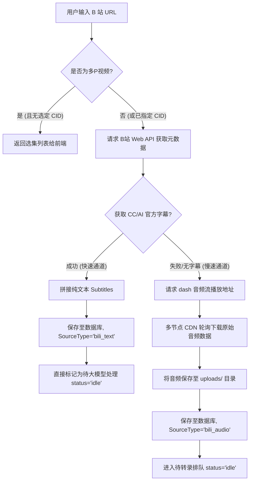
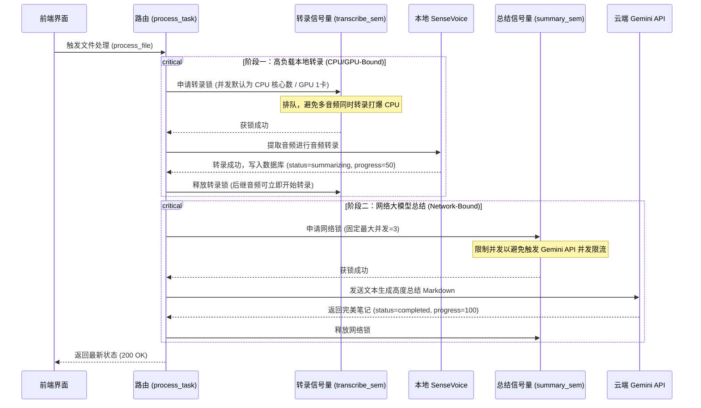

# AudioSense AI 核心架构与项目结构深度解析

> [!NOTE]
> 本文档旨在为开发者提供 **AudioSense AI (v2.0)** 的全面代码架构分析。该项目是一个融合了**本地轻量化语音转文字 (SenseVoice)** 与**云端大语言模型 (Gemini API) 智能总结**的音频学习助手。通过阅读本文，您将能够轻松定位并修改系统中的任意功能模块。

---

## 一、 整体技术栈与架构设计

项目采用 **前后端分离** 的全栈式设计，在运行部署、数据吞吐以及离在线结合上做了极致优化：

*   **前端（Frontend）**：采用轻量级、无框架依赖的 **Vanilla HTML5 / Modern JS / CSS3**，加载极速，逻辑内聚在 [api.js](file:///d:/Code/vibproj/audionotes-ai/frontend/js/api.js) 与 [app.js](file:///d:/Code/vibproj/audionotes-ai/frontend/js/app.js) 中。同时项目预留了一套基于 **React + TailwindCSS + Vite** 的高阶代码库（位于 `src/`、`server.ts` 等），以便未来平滑迁移。
*   **后端（Backend）**：基于 **FastAPI (Python)** 框架，具备高并发异步 I/O 能力。
*   **本地转录引擎**：使用阿里开源的 **SenseVoice-Small** (基于 FunASR)，非自回归架构。在 CPU 上推理速度是 Whisper 的 5~15 倍，且对粤语、日语、英语等多语言以及方言、声音事件（笑声、掌声等）有极强的识别能力，模型本地化运行，零 API 消耗。
*   **云端总结大脑**：调用最新的 **Gemini 2.5 Flash** 接口，通过精简的 Markdown 模板生成高度结构化的学习笔记。系统**仅向云端传输轻量级的转录文本，完全不传输原始音频数据**，实现了极低的云端带宽占用与极高的性价比。
*   **数据持久化**：使用 **SQLite** 嵌入式数据库，免去了安装大型 DB 的繁琐步骤，完全单机轻量化存储。

---

## 二、 目录结构全景图

项目的主目录及关键文件功能划分如下：

```text
audionotes-ai/
├── backend/                  # 后端核心代码 (Python FastAPI)
│   ├── main.py               # 1. FastAPI 入口：挂载路由、CORS、数据库初始化及静态前端挂载
│   ├── config.py              # 2. 配置管理：Pydantic Settings 加载环境变量、硬件加速 (CUDA) 检测
│   ├── models/                # 3. 数据库与 ORM 模型
│   │   ├── database.py       #    - SQLite 引擎初始化、Session 会话依赖 (get_db)
│   │   ├── orm.py            #    - AudioFile 物理表字段 (ID, 路径, 状态, 进度, 转录, 笔记等)
│   │   └── schemas.py        #    - Pydantic 输入输出校验模式 (请求体、B站导入数据格式)
│   ├── routers/               # 4. API 路由端点
│   │   ├── audio.py          #    - 音频上传、列表获取、单文件查询、物理与数据库删除
│   │   ├── process.py        #    - 异步转录与总结流水线、解耦并发控制 (Semaphore)、全局暂停
│   │   ├── bilibili.py       #    - B站视频解析、多P选集响应、快慢路导入逻辑
│   │   ├── export.py         #    - 单个 Markdown 下载、批量已完成笔记 ZIP 打包导出
│   │   └── models.py         #    - Gemini 可用模型列表动态抓取、SenseVoice 系统参数热更新
│   └── services/              # 5. 业务服务逻辑
│       ├── sensevoice_service.py # - FunASR 本地加载、Lazy-Load 懒加载、单线程/多线程音频转录
│       ├── gemini_service.py     # - Google GenAI SDK 集成、自定义 Prompt 格式化、文本生成
│       └── bilibili_service.py   # - B 站字幕/音频流 CDN 多节点冗余下载与解析
├── frontend/                 # 生产静态前端 (Vanilla JS)
│   ├── index.html            # 单页面结构 (UI 骨架)
│   ├── css/
│   │   └── styles.css        # 自定义极简轻奢 CSS
│   └── js/
│       ├── api.js            # 与后端 API 1:1 映射的封装客户端
│       └── app.js            # 响应式交互、状态更新、WebSocket 或轮询、文件上传及渲染逻辑
├── src/                      # 预留的高级 React + Vite 前端源码
│   ├── App.tsx               # 模块化 React UI (包含丰富的动画与玻璃拟物化设计)
│   └── ...
├── server.ts                 # 预留的高级 Node.js Express 代理与开发中间件
├── run.py                    # 后端一键启动入口 (uvicorn.run)
└── audionotes.db             # 运行时自动生成的 SQLite 本地数据库文件
```

---

## 三、 数据模型层 (Data Model)

系统依靠单张 `audio_files` 表进行核心业务流程驱动，底层通过状态机机制协调异步任务。ORM 定义在 [orm.py](file:///d:/Code/vibproj/audionotes-ai/backend/models/orm.py)，主要字段和状态机如下：

### 1. `AudioFile` 核心字段设计

| 字段名 | 类型 | 说明 | 示例值 |
| :--- | :--- | :--- | :--- |
| `id` | String (12位) | 主键，由 UUID 生成的短 ID | `f3a1d9e2b4c5` |
| `name` | String | 显示给用户的名称 | `"[B站字幕] 5分钟搞懂AI Agent.mp4"` |
| `file_path` | String | 本地音视频文件存储路径（B站纯字幕时为空） | `"./uploads/f3a1d9e2b4c5.mp4"` |
| `source_type` | String | 数据源头：`file`(上传)、`bili_text`(B站字幕)、`bili_audio`(B站音频) | `"bili_text"` |
| `status` | Enum (ProcessStatus) | 核心状态：`idle`, `transcribing`, `summarizing`, `completed`, `failed` | `ProcessStatus.SUMMARIZING` |
| `progress` | Integer | 前端展示的数字百分比进度 (0 - 100) | `50` |
| `transcription` | Text | 本地模型或B站提取的原汁原味语音转文字 | `"大家下午好，今天我们要讲的是..."` |
| `study_notes` | Text | Gemini 生成的 Markdown 格式学习笔记 | `"# AI Agent 解析\n## 核心摘要\n..."` |
| `custom_prompt` | Text | 运行此任务时传入的自定义提示词模板 | `""` |
| `error_message` | Text | 失败时的底层异常信息栈 | `"大模型生成失败: HTTP 503 Service Unavailable"` |

---

## 四、 核心工作流设计 (Workflows)

### 1. B 站视频导入深度解析 (Bilibili Import Pipeline)

B 站在音视频处理上非常智能，提供了 **“快慢两条处理路径”**。在 [bilibili_service.py](file:///d:/Code/vibproj/audionotes-ai/backend/services/bilibili_service.py) 中，系统优先尝试免下载的字幕解析，失败时才进行音频文件下载：



> [!TIP]
> **快速通道的优势**：若 B 站已有 AI 字幕或 CC 字幕，系统无需下载几十MB的音频，可在 **0.5秒内** 完成导入。由于自带文本，它将绕过高负载的本地 SenseVoice 转录，直接通过 **Gemini API** 生成笔记，体验行云流水！

---

### 2. 双重信号量解耦并发控制与暂停 (Decoupled Pipeline Semaphores)

音频转录属于 **CPU/GPU 密集型**，而大模型总结属于 **网络/API 密集型**。如果混用一个并发锁，会产生灾难：要么 CPU 被打爆卡死，要么云端 API 触发 503 限流。

在 [process.py](file:///d:/Code/vibproj/audionotes-ai/backend/routers/process.py) 中，系统设计了 **非阻塞的双阶段解耦流水线**：



#### 暂停/恢复机制：
系统内设全局状态量 `paused_state`，并在第一、第二阶段获锁、处理等各个生命周期节点插入了 `await check_pause()` 拦截。当您点击前端的“暂停”时，后端正在运行的任务会在下一个断点前安全挂起，完全不占用多余算力。

---

## 五、 如何修改代码：实战开发指引 (Modification Guide)

如果您希望在现有的代码基础上做二次开发，以下是最常见的几类修改场景与具体文件指引：

### 1. 修改/新增大模型输出模板与提示词 (Custom Prompts)

默认的提示词模板、输出格式均在 [gemini_service.py](file:///d:/Code/vibproj/audionotes-ai/backend/services/gemini_service.py#L43-L50) 中。
*   **如果您想添加新的分析部分**（例如：“追加代办清单、英语生词提示”）：
    可以直接编辑 `backend/services/gemini_service.py` 中的 `prompt` 构造逻辑。
*   **如果您希望让前端提供预设提示词**：
    可以修改 [schemas.py](file:///d:/Code/vibproj/audionotes-ai/backend/models/schemas.py#L6-L9) 中的 `ProcessRequest` 参数，再在 [app.js](file:///d:/Code/vibproj/audionotes-ai/frontend/js/app.js) 页面上为其制作一个新的 UI 按钮，调用 `API.processFile` 时传递对应参数即可。

### 2. 引入其他云端大模型 (如 OpenAI, DeepSeek, Anthropic)

如果您希望不局限于 Gemini：
1.  在 `backend/services/` 下创建新的服务（例如：`deepseek_service.py`）。
2.  在 [process.py](file:///d:/Code/vibproj/audionotes-ai/backend/routers/process.py#L111-L116) 中，原本调用 `gemini_service.generate_notes` 的位置引入新的服务：
    ```python
    # 替换前：
    # notes = await gemini_service.generate_notes(...)
    # 替换后：
    # notes = await deepseek_service.generate_notes(...)
    ```

### 3. 修改数据库结构或表字段 (Schema Expansion)

例如，您想为学习笔记增加一个 **“分类标签 (Category)”** 字段：
1.  **编辑 ORM 模型**：在 [orm.py](file:///d:/Code/vibproj/audionotes-ai/backend/models/orm.py) 的 `AudioFile` 属性中增加：
    ```python
    category = Column(String, default="未分类")
    ```
    不要忘记在 `to_dict(self)` 方法中追加对 `"category": self.category` 的输出映射。
2.  **更新 Pydantic 传输层**：修改 [schemas.py](file:///d:/Code/vibproj/audionotes-ai/backend/models/schemas.py) 中的 `AudioFileResponse`，加入对应的字段声明。
3.  **重新初始化**：由于使用了 SQLite 且设置了 `init_db`，如果您在开发阶段修改了字段，可以直接把根目录下的 `audionotes.db` 文件物理删除，后端重新运行 `python run.py` 时就会自动以最新结构创建表。

### 4. 优化本地语音识别参数 (Transcription Tweaks)

如果您在具有高配置的独立 GPU 显卡（如 NVIDIA RTX）上运行：
*   **硬件自适应加载**：系统在 [config.py](file:///d:/Code/vibproj/audionotes-ai/backend/config.py#L26-L35) 中，默认会对 `SENSEVOICE_DEVICE` 实施自适应检测。若 `torch` 可导入且有 CUDA，会自动切换为 `cuda` 硬件加速。
*   **修改切片参数（VAD）**：如果转录超长音频时识别精度有偏差，可以去 [sensevoice_service.py](file:///d:/Code/vibproj/audionotes-ai/backend/services/sensevoice_service.py#L32-L38) 中修改 `AutoModel` 实例化的 `vad_kwargs` 设定（例如：调整语音静音切片最大时长为 30秒 或更长）。

### 5. 新增更多的笔记导出格式 (Markdown -> PDF / Word)

目前仅支持导出 Markdown 以及打包 ZIP。若想添加 PDF 生成：
1.  在 [export.py](file:///d:/Code/vibproj/audionotes-ai/backend/routers/export.py) 中新增一个路由端点（如 `/api/export/{file_id}/pdf`）。
2.  使用 `reportlab` 或 `pdfkit` 在后端将 `f.study_notes` (Markdown 文本) 渲染转换为 PDF 字节流。
3.  通过 `StreamingResponse` 返回给前端下载。
4.  在 [api.js](file:///d:/Code/vibproj/audionotes-ai/frontend/js/api.js) 中加入获取该 PDF 地址的客户端方法，并在页面上绘制一个“下载 PDF”按钮。

---

## 六、 总结与快速自查手册

在您着手开发前，可以通过下表快速判断修改范围：

| 想要实现的修改 | 核心修改文件 | 辅助配套文件 |
| :--- | :--- | :--- |
| **调整前端 UI 样式、更换配色、美化卡片** | [styles.css](file:///d:/Code/vibproj/audionotes-ai/frontend/css/styles.css) | [index.html](file:///d:/Code/vibproj/audionotes-ai/frontend/index.html) |
| **修改交互响应（如上传后自动触发运行、改变状态轮询间隔）** | [app.js](file:///d:/Code/vibproj/audionotes-ai/frontend/js/app.js) | [index.html](file:///d:/Code/vibproj/audionotes-ai/frontend/index.html) |
| **接入全新大语言模型，扩展自定义提示词参数** | [gemini_service.py](file:///d:/Code/vibproj/audionotes-ai/backend/services/gemini_service.py) | [process.py](file:///d:/Code/vibproj/audionotes-ai/backend/routers/process.py) |
| **新增后端管理端点（如清空指定状态的全部历史记录）** | [audio.py](file:///d:/Code/vibproj/audionotes-ai/backend/routers/audio.py) | [api.js](file:///d:/Code/vibproj/audionotes-ai/frontend/js/api.js) |
| **调整后台转录并发排队上限以提高吞吐** | [process.py](file:///d:/Code/vibproj/audionotes-ai/backend/routers/process.py) | [config.py](file:///d:/Code/vibproj/audionotes-ai/backend/config.py) |
